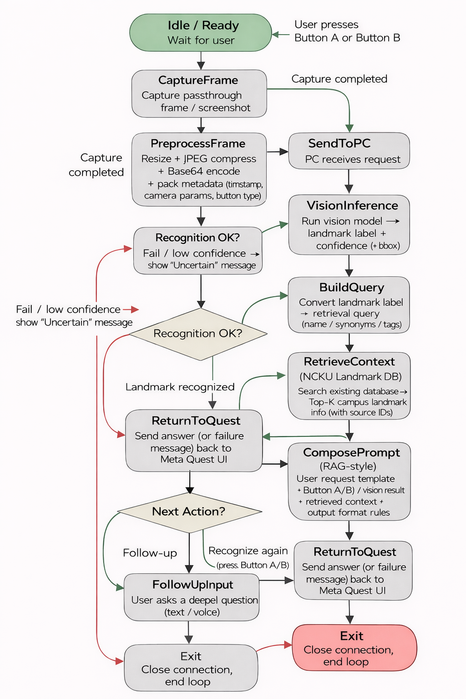

# NCKU AR 校園地標導覽（Meta Quest × Vision × RAG × LLM）

本專案是一套在 **Meta Quest Passthrough** 中運作的校園導覽系統：使用者在 Quest 端按下按鈕擷取畫面，送到 PC 端進行 **YOLO 地標辨識**，再結合 **校園地標資料庫（Landmark DB）** 以 **RAG** 方式組 Prompt，呼叫 **LLM（Ollama / Gemma3）** 產生導覽回答與兩個追問按鈕，最後回傳到 Quest UI 顯示。

> 建議把流程圖放到：`docs/system_flow.png`，README 會直接引用。



---

## 1. 功能摘要（老師好讀版）

- **Quest 端互動（Unity）**
  - Button A：問「這裡是哪裡？」（mode=where）
  - Button B：問「這個景點有什麼意義？」（mode=meaning）
  - 顯示「大回覆框」＋「兩個追問按鈕」
  - 追問時 **沿用上一張截圖**，以 `mode=ask` 送出問題（更快、互動更順）

- **PC 端推論（FastAPI）**
  - `/analyze`：收 `image_b64` → YOLO 推論 → 查 `LANDMARK_DB` → LLM 生成 → 回傳 `AnalyzeResponse`
  - `/health`：回報服務與設定狀態（YOLO 是否載入、LLM model 名稱等）

- **韌性設計**
  - YOLO 無法對應資料庫：回 `status="unsure"` 並提示使用者重拍/換角度
  - LLM 失敗：以 DB 事實內容做 **fallback answer**，確保 Quest UI 不空白

---

## 2. 專案架構

```
Meta Quest (Unity)
  └─ 擷取畫面 → JPEG/縮圖 → Base64 → POST /analyze
                      │
                      ▼
PC Server (FastAPI)
  ├─ Vision Inference: YOLO (best.pt)
  ├─ Landmark DB: LANDMARK_DB (where/meaning/keywords)
  ├─ Prompt Builder: build_messages()
  ├─ LLM Call: call_llm()  (Ollama-style / gateway)
  └─ Response: answer + followups → Quest UI
```

---

## 3. API 規格（最重要的兩支）

### 3.1 `GET /health`
用途：確認服務是否可用、YOLO 是否載入、LLM 設定是否正確。

回傳範例：
```json
{
  "ok": true,
  "yolo_loaded": true,
  "api_key_set": true,
  "base_url": "https://api-gateway.netdb.csie.ncku.edu.tw",
  "llm_model": "gemma3:4b"
}
```

### 3.2 `POST /analyze`
Quest 端送出截圖與模式，PC 端回傳導覽答案與兩個追問。

Request（簡化）：
```json
{
  "request_id": "xxx",
  "mode": "where | meaning | both | ask",
  "image_b64": "base64(jpeg bytes)",
  "question": "當 mode=ask 才需要"
}
```

Response（簡化）：
```json
{
  "request_id": "xxx",
  "status": "ok | unsure | error",
  "answer": "導覽文字",
  "followups": ["追問1", "追問2"],
  "place_name": "景點名稱",
  "pred_class": "tree",
  "confidence": 0.83
}
```

---

## 4. 環境建置（PC Server）

> 下列步驟以 Windows 為例（PowerShell）。若你用 WSL/Linux，指令幾乎相同。

### 4.1 Python 虛擬環境
（擇一）使用 venv：
```bash
python -m venv venv
.\venv\Scripts\activate
```

或使用 conda：
```bash
conda create -n quest_server python=3.10 -y
conda activate quest_server
```

### 4.2 安裝套件
```bash
pip install -r requirements.txt
```

### 4.3 準備 YOLO 權重
把訓練好的權重放到 server 目錄（或你設定的路徑）：
- `best.pt`

並確認程式中：
```py
YOLO_MODEL_PATH = "best.pt"
```

### 4.4 LLM（Ollama / 或 Gateway）
本專案支援 **Ollama-style** 回覆格式（含 `message.content` 與各種 duration 欄位）。

### 4.5 設定環境變數
（擇一）用 PowerShell：
```powershell
$env:BASE_URL="https://api-gateway.netdb.csie.ncku.edu.tw"
$env:API_KEY="YOUR_KEY"
$env:LLM_MODEL="gemma3:4b"
```

### 4.6 啟動 FastAPI Server
```bash
python main.py

## 5. 環境建置（Unity / Meta Quest）

### 5.1 Unity 版本建議
- Unity 2022.3 LTS（或相近 LTS）
- Android Build Support 已安裝（Unity Hub → Installs → Add modules）

### 5.2 Meta XR / Passthrough
- 專案中安裝 Meta XR SDK / Oculus Integration（依你的專案模板而定）
- 啟用 Passthrough 功能（依 Meta XR 範例或專案設定）

### 5.3 設定 Quest 端 API URL
在 `StartMenu.cs`：
```csharp
public string AnalyzeUrl = "http://127.0.0.1:8000/analyze";
```

### 5.4 連線方式（推薦：USB + adb reverse）
USB 連 PC 時，可讓 Quest 直接打 `127.0.0.1:8000`：
```bash
adb reverse tcp:8000 tcp:8000
```

> 若不用 adb reverse，則把 `AnalyzeUrl` 改成 PC 的 LAN IP（例如 `http://192.168.x.x:8000/analyze`）。

### 5.5 Build & Run
- Build Settings → Platform：Android
- Target Device：Meta Quest
- Build And Run

---
